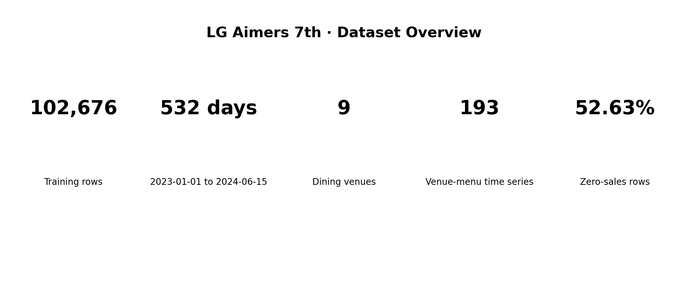
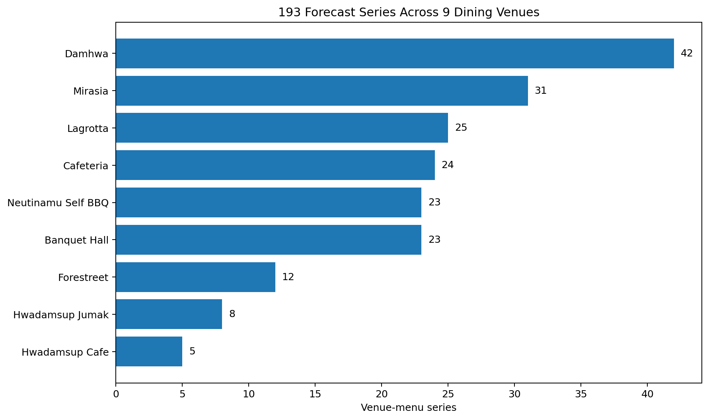
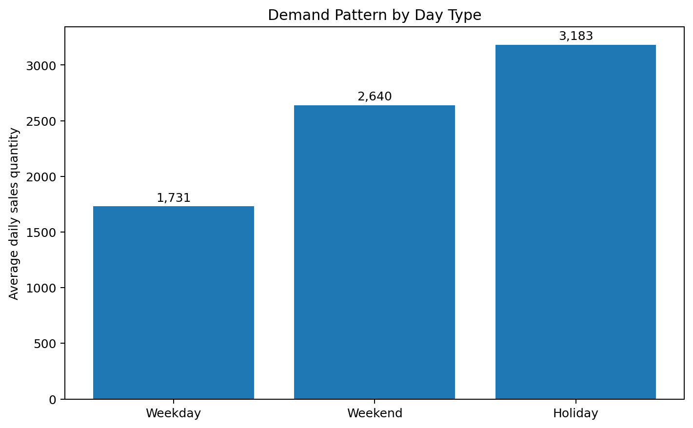
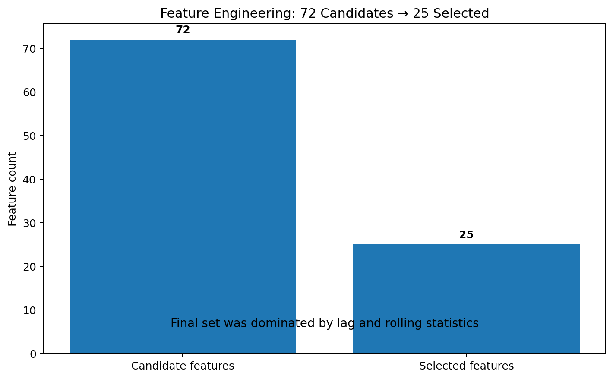
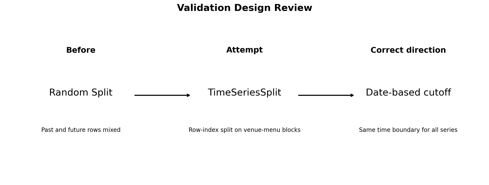
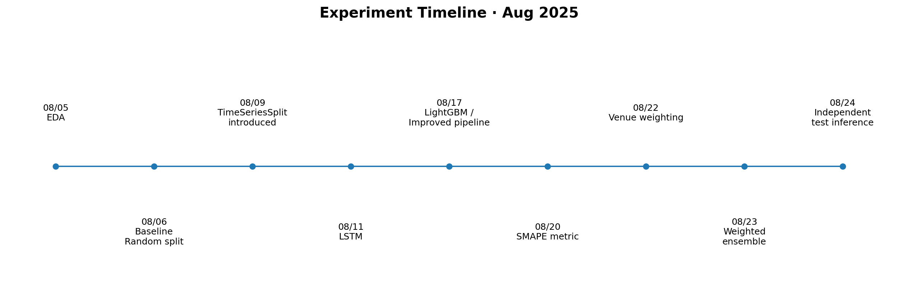

<h1 align="center">📈 LG Aimers 7th</h1>

<h3 align="center">
곤지암리조트 식음업장 메뉴 수요예측<br/>
데이터의 흐름을 분석하고 실험 기준을 점검한 AI 프로젝트
</h3>

<p align="center">
  <b>LG Aimers 7기 · 식음업장 메뉴 수요 예측 AI 온라인 해커톤</b>
</p>

<p align="center">
  
  
  
  
  
  
</p>

<br/>

<p align="center">
  
</p>

<br/>

## 📌 Project Highlights

| **실제 기업 데이터** | **9개 식음업장** | **193개 예측 시계열** | **72 → 25 Feature** |
|:---:|:---:|:---:|:---:|
| LG D&O · 곤지암리조트 | 리조트 F&B | 업장–메뉴 조합 | 중요도 기반 선택 |

> ### 💡 “성능이 정체될 때 모델을 더 복잡하게 만드는 것만이 답은 아니었습니다.”
>
> 실제 식음업장 판매 데이터를 분석하면서  
> **데이터의 시간 흐름, 피처의 의미, 평가 기준이 예측 결과에 어떤 영향을 주는지**를 확인했습니다.

### 👩‍💻 프로젝트 한눈에 보기

| 항목 | 내용 |
|---|---|
| **프로젝트** | LG Aimers 7기 식음업장 메뉴 수요 예측 AI 온라인 해커톤 |
| **문제 제공** | LG D&O |
| **대상** | 곤지암리조트 식음업장 |
| **기간** | 2025.07 ~ 2025.08 |
| **역할** | 데이터 분석 · Feature Engineering · 모델 실험 |
| **예측 문제** | 최근 28일 판매수량을 기반으로 이후 7일 판매수량 예측 |
| **평가 지표** | SMAPE 기반 평가 |
| **Original Repository** | LG-AImers-team/LG-AImers |

> ℹ️ 이 저장소는 채용 포트폴리오용 개인 Showcase입니다.  
> 실제 실험 코드와 결과를 바탕으로 문제 정의와 실험 과정을 중심으로 재구성했습니다.

---

## 📜 목차

1. [프로젝트 소개](#1-프로젝트-소개-)
2. [데이터 이해](#2-데이터-이해-)
3. [EDA](#3-eda-)
4. [담당 역할](#4-담당-역할-)
5. [실험 과정](#5-실험-과정-)
6. [Feature Engineering](#6-feature-engineering-)
7. [모델링과 앙상블](#7-모델링과-앙상블-)
8. [검증 방식에 대한 회고](#8-검증-방식에-대한-회고-)
9. [개발 타임라인](#9-개발-타임라인-)
10. [결과](#10-결과-)
11. [What I Learned](#11-what-i-learned-)

---

## 1. 프로젝트 소개 🏨

### 실제 리조트 식음업장의 미래 메뉴 수요를 예측하다

LG Aimers 7기 온라인 해커톤에서  
**LG D&O가 운영하는 곤지암리조트의 실제 식음업장 판매 데이터**를 활용해
메뉴별 미래 판매수량을 예측했습니다.

예측 대상은 단순한 하나의 매출 시계열이 아니었습니다.

9개 식음업장에서 판매하는 각 메뉴를 독립적인 시계열로 구분했고,
총 **193개의 업장–메뉴 조합**에 대해 예측을 수행했습니다.

```text
최근 28일 판매 데이터
          ↓
   데이터 분석 / 전처리
          ↓
     Feature 생성
          ↓
      모델 학습
          ↓
이후 7일 판매수량 예측
```

식음업장 수요를 미리 예측할 수 있다면
식자재 발주·재고 계획, 품절 위험 관리, 성수기 운영 계획 등
실제 리조트 운영 의사결정을 지원할 수 있습니다.

---

## 2. 데이터 이해 📊

### 532일 × 193개 시계열의 완전 패널

학습 데이터는
**2023년 1월 1일부터 2024년 6월 15일까지 총 532일**로 구성되어 있습니다.

| 항목 | 규모 |
|---|---:|
| 학습 데이터 | **102,676행** |
| 기간 | **532일** |
| 식음업장 | **9개** |
| 고유 메뉴 문자열 | **176개** |
| 업장–메뉴 조합 | **193개** |
| 판매량 0인 데이터 | **약 52.63%** |

각 업장–메뉴 조합에 532일 데이터가 존재하여

```text
532일 × 193개 조합 = 102,676행
```

의 패널 데이터를 구성합니다.

다만 판매가 발생하지 않은 날이 전체의 절반 이상이어서,
단순히 평균 판매량만으로는 각 메뉴의 수요 패턴을 설명하기 어려웠습니다.

---

### 9개 식음업장의 서로 다른 판매 구조

<p align="center">
  
</p>

| 업장 | 업장–메뉴 조합 수 |
|---|---:|
| 담하 | 42 |
| 미라시아 | 31 |
| 라그로타 | 25 |
| 카페테리아 | 24 |
| 느티나무 셀프BBQ | 23 |
| 연회장 | 23 |
| 포레스트릿 | 12 |
| 화담숲주막 | 8 |
| 화담숲카페 | 5 |

한식 중심 업장부터 브런치·양식·카페·BBQ·연회까지
업장의 성격과 메뉴 구성이 달랐기 때문에
하나의 단순한 판매 패턴으로 전체 데이터를 설명하기 어려웠습니다.

---

## 3. EDA 🔍

### 판매량은 요일과 휴일에 따라 크게 달라졌습니다

데이터를 날짜 단위로 분석하면서
평일·주말·공휴일의 전체 판매량 차이를 확인했습니다.

<p align="center">
  
</p>

| 구분 | 일평균 판매수량 |
|---|---:|
| 평일 | 1,730.95 |
| 주말 | 2,639.67 |
| 공휴일 | 3,182.52 |

주말의 일평균 판매수량은 평일보다 높았고,
공휴일에는 그 차이가 더욱 커졌습니다.

또한 EDA에서는 다음 내용을 확인했습니다.

- 월별 판매 흐름
- 업장별 판매 패턴
- 메뉴별 판매량 차이
- 평일·주말·공휴일 수요 변화
- 계절별 판매 변화
- 업장별 메뉴 구성 차이

이 결과를 바탕으로
날짜와 최근 판매 흐름을 표현할 수 있는 다양한 후보 변수를 설계했습니다.

---

## 4. 담당 역할 👩‍💻

### Data Analysis · Feature Engineering · Modeling

프로젝트에서 데이터 분석과 모델 실험을 담당했습니다.

### 주요 수행 내용

- 식음업장 판매 데이터 EDA 및 전처리
- 날짜·업장·메뉴 기반 Feature Engineering
- LightGBM 기반 개선 파이프라인 실험
- 모델 평가 지표를 SMAPE 기준으로 정리
- 업장별 가중 학습 실험
- LightGBM · XGBoost · CatBoost · RandomForest 앙상블 실험
- Test Sample 간 예측 이력이 섞이지 않도록 추론 구조 수정
- 실험 결과를 비교하며 다음 개선 방향 설정

> 단순히 모델을 실행하는 데서 끝내기보다  
> **어떤 데이터와 기준으로 평가했는지를 함께 확인하려 했습니다.**

---

## 5. 실험 과정 🧪

프로젝트 기간 동안 하나의 모델을 고정하기보다
여러 접근을 단계적으로 비교했습니다.

### 1️⃣ 초기 Tree 기반 모델

초기에는 빠르게 기준 성능을 확인하기 위해
RandomForest와 XGBoost 계열 모델을 실험했습니다.

### 2️⃣ LSTM 실험

28일의 판매 흐름으로 이후 7일을 예측하도록
LSTM 계열 모델도 실험했습니다.

```text
28-day Sequence
       ↓
      LSTM
       ↓
7-day Forecast
```

메뉴별 LSTM과 통합 모델을 비교하면서
시계열 모델이 이 데이터에 어떤 방식으로 적용될 수 있는지 확인했습니다.

### 3️⃣ Boosting 모델 확대

이후 트리 기반 부스팅 모델을 중심으로 실험 범위를 넓혔습니다.

- LightGBM
- XGBoost
- CatBoost
- RandomForest

### 4️⃣ 모델 조합

서로 다른 모델의 예측값을 결합해
개별 모델의 오차를 보완하는 앙상블도 실험했습니다.

---

## 6. Feature Engineering ⚙️

### 72개의 후보 변수에서 25개를 선택

초기 데이터는 날짜, 업장–메뉴 식별자, 판매수량이 중심이었습니다.

이를 바탕으로 판매 흐름을 표현하기 위한
**72개의 후보 Feature**를 생성했습니다.

### 후보 Feature

#### 📅 Calendar

- 월
- 일
- 주차
- 분기
- 주말 여부
- 공휴일 여부
- 월초 / 월말
- 요일 one-hot
- 계절
- 스키 시즌 여부

#### ⏱️ Lag

- 1일
- 3일
- 7일
- 14일
- 28일

#### 📈 Rolling Statistics

- Rolling Mean
- Rolling Standard Deviation
- Rolling Maximum
- Rolling Minimum

각각 3·7·14·28일 구간을 실험했습니다.

#### 🏪 Menu / Venue

- 메뉴 특성
- 업장 구분
- 업장과 주말 간 Interaction
- 공휴일과 계절 Interaction

---

<p align="center">
  
</p>

후보 변수를 모두 사용하는 대신
중요도를 비교해 최종적으로 **25개 Feature**를 선택했습니다.

최종 Feature에는 특히

- lag 1 / 3 / 7 / 14 / 28
- rolling mean
- rolling std
- rolling max / min
- 최근 추세
- 일부 날짜 Feature

가 중심적으로 남았습니다.

> 많은 변수를 추가하는 것보다  
> **실제 예측에 의미 있는 정보가 무엇인지 확인하는 과정이 더 중요했습니다.**

---

## 7. 모델링과 앙상블 🤖

### 여러 모델의 오차 특성을 비교했습니다

최종 실험 과정에서는 다음 네 모델을 함께 비교했습니다.

| Model | 역할 |
|---|---|
| **LightGBM** | Gradient Boosting 기반 주요 모델 |
| **XGBoost** | Boosting 모델 비교 |
| **CatBoost** | 다른 boosting 구조의 예측 특성 비교 |
| **RandomForest** | Bagging 계열 비교 모델 |

각 모델을 독립적으로 비교한 뒤
여러 모델의 예측값을 결합하는 가중 앙상블을 구성했습니다.

```text
LightGBM
     │
XGBoost
     │
CatBoost
     ├──── Weighted Ensemble ──── Final Prediction
RandomForest
```

특정 업장의 평가 중요도를 고려한
업장별 가중 학습도 함께 실험했습니다.

---

## 8. 검증 방식에 대한 회고 🧭

### 모델보다 먼저 검증 기준을 확인해야 했습니다

초기 파이프라인에서는
일반적인 Random Split 방식으로 학습 데이터와 검증 데이터를 분리했습니다.

하지만 이 문제는
**과거 데이터를 이용해 미래 판매량을 예측하는 시계열 문제**였습니다.

따라서 과거와 미래 시점이 임의로 섞인 검증은
실제 예측 상황과 다를 수 있다고 판단했고,
시계열 분할을 적용하는 방향으로 실험을 수정했습니다.

프로젝트 이후 저장소를 다시 점검하면서
검증 방식 자체에도 추가로 확인해야 할 부분이 있다는 것을 발견했습니다.

<p align="center">
  
</p>

업장–메뉴별로 정렬된 패널 데이터에
행 인덱스 기준 `TimeSeriesSplit`을 적용하면
각 Fold가 모든 메뉴에 공통된 날짜 경계를 갖는다고 보장할 수 없습니다.

즉 시계열 문제에서 중요한 것은
라이브러리 이름 자체가 아니라

**“학습에 사용한 모든 날짜보다 검증 날짜가 실제로 뒤에 있는가”**

를 직접 확인하는 것이었습니다.

### 더 적절한 검증 방향

```text
전체 업장–메뉴

Train
2023-01-01 ───────────── 2024-03-31

Validation
                         2024-04-01 ── 2024-04-28

                 ↓

모든 메뉴에 동일한 날짜 Cutoff 적용
```

이 경험 이후에는
검증 도구를 적용했다는 사실보다
**실제 분할 결과가 의도한 평가 조건을 만족하는지 확인하는 것**을 더 중요하게 봅니다.

---

## 9. 개발 타임라인 🗓️

<p align="center">
  
</p>

```text
EDA
 ↓
초기 Tree Model
 ↓
검증 방식 점검
 ↓
LSTM
 ↓
LightGBM 개선
 ↓
Feature Engineering
 ↓
SMAPE 기반 비교
 ↓
업장 가중 실험
 ↓
가중 Ensemble
 ↓
Test Sample 독립 추론 보완
```

짧은 해커톤 기간 동안
한 번의 모델 선택으로 끝내기보다
실험 결과를 기준으로 다음 접근을 계속 수정했습니다.

---

## 10. 결과 🏁

### 프로젝트에서 얻은 결과

- 곤지암리조트 실제 식음업장 데이터 기반 수요예측 수행
- 9개 업장의 193개 업장–메뉴 시계열 분석
- 102,676행의 패널 데이터 분석
- 72개 후보 Feature 설계
- 중요도 기반 25개 Feature 선택
- LSTM과 여러 Tree 기반 모델 비교
- LightGBM · XGBoost · CatBoost · RandomForest 앙상블 실험
- 업장별 가중 학습 실험
- 시계열 데이터의 검증 방식과 평가 경계에 대한 이해 확장

### Repository

원본 프로젝트에서는
Notebook과 Python Pipeline을 통해
EDA부터 모델링·예측까지의 실험 기록을 관리했습니다.

```text
EDA
├─ eda.ipynb
│
Modeling
├─ modeling.ipynb
├─ lightgbm.ipynb
├─ LSTM
│
Improved Pipeline
├─ improved_feature_engineering.py
├─ improved_model_training.py
├─ improved_model_training_weighted.py
└─ improved_prediction.py
```

---

## 11. What I Learned 💭

이 프로젝트에서 가장 크게 배운 것은
**모델의 성능만큼 평가 과정이 타당한지를 확인하는 일이 중요하다**는 점입니다.

처음에는 성능이 기대만큼 오르지 않으면
새로운 모델과 변수를 추가하는 데 집중했습니다.

하지만 여러 실험을 반복하면서
같은 모델이라도 데이터가 어떻게 분리되고,
어떤 Feature를 사용하며,
어떤 기준으로 평가하느냐에 따라
결과의 의미가 달라질 수 있다는 점을 확인했습니다.

특히 시계열 데이터에서는
`TimeSeriesSplit`이라는 이름의 도구를 사용했다는 사실보다
**실제 Train과 Validation의 날짜 경계가 의도한 방식으로 나뉘었는지**가 더 중요했습니다.

그래서 이후에는 모델을 비교하기 전에 다음을 먼저 확인합니다.

| 확인 기준 | 질문 |
|---|---|
| **데이터** | 실제 예측 시점에 사용할 수 있는 정보인가? |
| **분할** | 미래 데이터가 학습 과정에 섞이지 않았는가? |
| **Feature** | 이 변수가 실제 수요 패턴을 설명하는가? |
| **평가** | 현재 지표가 문제의 목표와 맞는가? |
| **재현성** | 같은 조건에서 다시 실행해도 결과를 확인할 수 있는가? |

> ### 좋은 모델을 찾는 것보다 먼저, **그 모델을 믿을 수 있는 평가 기준을 만드는 개발자**
>
> LG Aimers를 통해 세운 데이터 분석의 기준입니다.

---

## 🛠️ Tech Stack

| 영역 | 기술 |
|---|---|
| **Language** | Python |
| **Data Processing** | Pandas · NumPy |
| **Visualization** | Matplotlib |
| **Modeling** | LightGBM · XGBoost · CatBoost · RandomForest · LSTM |
| **Evaluation** | SMAPE |
| **Experiment** | Jupyter Notebook |
| **Collaboration** | Git · GitHub |

---

<p align="center">
  <b>LG Aimers 7기</b><br/>
  식음업장 메뉴 수요 예측 AI 온라인 해커톤<br/>
  <b>윤다인</b>
</p>
